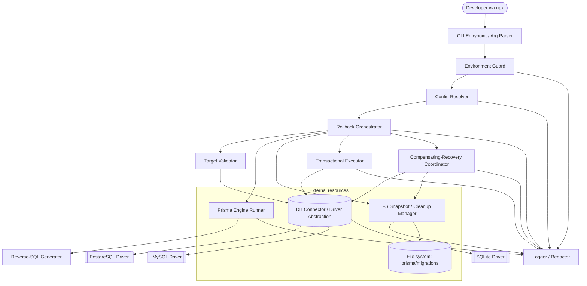

# Design Document

## Overview

The **Prisma True Rollback CLI** (the **CLI**) is a TypeScript/Node.js command-line tool, distributed and invoked via `npx`, that performs a *true, destructive* rollback of the most recently applied Prisma migration in a development environment. Because Prisma is "roll-forward only," the CLI orchestrates a fixed, ordered sequence that erases all trace of a migration from both the database and the file system while keeping Prisma's migration tracking internally consistent.

The core design challenge is **atomicity across two heterogeneous resources** — a relational database and the local file system — neither of which shares a transaction manager. The CLI resolves this with:

1. A **fixed step sequence** with a single point of no return.
2. A **single database transaction** wrapping the reverse-SQL application and the tracking-table cleanup (Requirement 4).
3. A **pre-operation snapshot** (tracking-table record + full migration folder contents) captured before the first destructive action, enabling **compensating recovery** on any partial failure (Requirement 6).
4. Layered **dev-only safeguards** — environment detection, destructive-operation warning, interactive confirmation, dry-run, and override flags (Requirements 1, 2, 3).

The Rollback_Operation is intentionally scoped to **only the most recently applied migration** (Requirement 1.6), which keeps the reverse-SQL generation well-defined (diff between "current schema" and "schema at N-1") and keeps recovery tractable (there is exactly one snapshot to restore).

### Rollback_Operation step sequence (canonical numbering)

The user-visible step numbering (Requirement 8.1, "Step X of 5") refers to the **destructive/executing** portion of the operation. Pre-flight validation (argument parsing, environment guard, config resolution, target validation) runs before Step 1 and produces no changes.

| Step | Name | Destructive? | Primary Requirement |
|------|------|--------------|---------------------|
| Pre-flight | Parse args, guard environment, resolve config, validate target | No | 1, 2, 7 |
| Step 1 of 5 | Generate Reverse_SQL (Prisma engine child process) | No | 3 |
| Step 2 of 5 | Capture Pre_Operation_Snapshot | No (read-only) | 6.1 |
| Step 3 of 5 | Apply reverse SQL + delete tracking record (single transaction) | **Yes** | 4 |
| Step 4 of 5 | Snapshot then delete Migration_Folder | **Yes** | 5 |
| Step 5 of 5 | Confirm success | No | 5.5, 5.6 |

> Note: Step 2 (snapshot) is read-only but is the mandatory precondition for the first *destructive* action (Step 3). Requirement 6.1 requires the snapshot to exist before any destructive action — the folder snapshot portion needed for Step 4 restore is captured here as part of the Pre_Operation_Snapshot, satisfying both 6.1 and providing the data 5.1 requires.

## Architecture

### High-level architecture

The CLI is organized as a thin **orchestrator** that drives a set of single-responsibility components. Database-engine differences are hidden behind a **driver abstraction** so the orchestrator is engine-agnostic. All output flows through a **Logger/Redactor** so credential redaction (Requirement 8.4, 8.5) is enforced in one place.



### Control flow (happy path + failure branches)

```mermaid
sequenceDiagram
    participant U as User
    participant O as Orchestrator
    participant E as Prisma Engine Runner
    participant S as Snapshot Manager
    participant T as Transactional Executor
    participant R as Recovery Coordinator

    U->>O: rollback <migration> [flags]
    O->>O: Pre-flight (guard, config, validate target)
    O->>E: Step 1: generate Reverse_SQL
    alt engine fails / empty / timeout / not found
        E-->>O: error
        O-->>U: non-zero exit, no changes
    end
    O->>S: Step 2: capture Pre_Operation_Snapshot
    alt snapshot capture fails
        S-->>O: error
        O-->>U: non-zero exit, no destructive change
    end
    Note over O,T: POINT OF NO RETURN — first destructive action
    O->>T: Step 3: BEGIN; reverse SQL; DELETE tracking; COMMIT
    alt transaction fails
        T-->>O: rolled back (DB unchanged)
        O-->>U: non-zero exit, no FS change yet
    end
    O->>S: Step 4: snapshot-then-delete Migration_Folder
    alt FS delete fails
        S-->>O: error
        O->>R: initiate Compensating_Recovery
        R->>T: restore DB (re-apply forward SQL + reinsert record)
        R->>S: restore Migration_Folder from snapshot
        R-->>O: recovery result
        O-->>U: exit 1, prior state restored (or manual-steps report)
    end
    O-->>U: Step 5: success, exit 0
```

### Key architectural decisions

- **Single transaction for DB atomicity (R4).** Reverse SQL and the tracking-record DELETE run in one transaction. On any statement failure the whole transaction rolls back, so the DB half of the operation is inherently atomic without compensation. Compensation is only needed for failures that happen *after* the transaction commits (i.e., during Step 4 file deletion).
- **Transactional-DDL guard before any DDL (R4.6).** MySQL performs implicit commits on DDL statements, so a mid-transaction DDL failure cannot be rolled back. The driver abstraction exposes a `supportsTransactionalDDL` capability; if false, the orchestrator aborts *before* executing any reverse SQL. PostgreSQL and SQLite support transactional DDL and pass the guard.
- **Snapshot before first destructive action (R6.1).** The Pre_Operation_Snapshot captures both the tracking record and the full folder contents. It is captured after reverse-SQL generation (which is non-destructive and could fail) but before the transaction, so recovery always has a complete restore source.
- **Recovery uses forward re-application, not a saved "undo of the undo."** To restore the DB during compensation, the coordinator re-applies the original migration's forward `migration.sql` (available in the folder snapshot) inside a fresh transaction and re-inserts the saved tracking record. This is symmetrical and avoids needing a second generated diff.
- **Central redaction (R8.4, R8.5).** No component writes directly to stdout/stderr; everything goes through the Logger, which redacts credentials from every message, including verbose output.

## Components and Interfaces

All interfaces below are TypeScript. Types referenced (e.g. `ResolvedConfig`, `PreOperationSnapshot`) are defined in the Data Models section.

### 1. CLI Entrypoint / Argument Parser

Responsible for parsing `argv`, handling `--version` (R1.7), and enforcing the arity rules for the migration-name argument (R1.1–R1.3).

```ts
interface ParsedArgs {
  migrationName: string;      // required unless a terminal flag is set
  flags: {
    version: boolean;         // R1.7  --version / -v
    dryRun: boolean;          // R3.4  --dry-run
    yes: boolean;             // R2.6  --yes / -y (non-interactive confirm)
    override: boolean;        // R2.2  --override (ambiguous-env authorization)
    verbose: boolean;         // R8.4  --verbose
  };
}

type ArgParseResult =
  | { kind: 'run'; args: ParsedArgs }
  | { kind: 'version' }                       // R1.7 -> print version, exit 0
  | { kind: 'error'; message: string; exitCode: 1 }; // R1.2, R1.3

interface ArgParser {
  parse(argv: string[]): ArgParseResult;
}
```

- No positional migration name → `error` reporting the missing argument (R1.2).
- More than one positional name → `error` reporting only one name is accepted (R1.3).
- `--version` short-circuits before any operation (R1.7).

### 2. Environment Guard

Determines whether the invocation is permitted and classifies the environment (R2.1, R2.2). Runs before config-dependent target validation but consumes the resolved connection target designation when available.

```ts
type EnvClassification = 'development' | 'production' | 'ambiguous';

interface EnvironmentGuard {
  classify(input: {
    nodeEnv: string | undefined;
    connectionTargetDesignation: 'production' | 'development' | undefined;
  }): EnvClassification;

  // Returns a guard decision the orchestrator acts on.
  evaluate(classification: EnvClassification, overrideFlag: boolean): GuardDecision;
}

type GuardDecision =
  | { allow: true }
  | { allow: false; reason: 'production'; exitCode: number }   // R2.1 non-zero
  | { allow: false; reason: 'ambiguous'; exitCode: number };   // R2.2 non-zero
```

- `production` classification → block regardless of override (R2.1). Override only rescues `ambiguous`.
- `ambiguous` + no override → block (R2.2); `ambiguous` + override → allow.
- `NODE_ENV === 'production'` OR production connection designation ⇒ `production`. Missing/unrecognized `NODE_ENV` AND absent designation ⇒ `ambiguous`. Otherwise `development`.

### 3. Config Resolver

Reads `schema.prisma` datasource + `DATABASE_URL`, resolves engine and connection parameters (R7.1, R7.2, R7.5).

```ts
type DbEngine = 'postgresql' | 'mysql' | 'sqlite';

interface ConfigResolver {
  resolve(cwd: string, env: NodeJS.ProcessEnv): ResolvedConfig; // throws ConfigError
}

interface ResolvedConfig {
  engine: DbEngine;
  connectionUrl: string;          // held only in memory; never logged raw
  migrationsDir: string;          // absolute path to prisma/migrations
  schemaPath: string;             // absolute path to schema.prisma
  connectionTargetDesignation?: 'production' | 'development';
}
```

- Missing `schema.prisma` or unset/empty `DATABASE_URL` → `ConfigError` identifying the missing source (R7.2, exit 1).
- Engine not in {postgresql, mysql, sqlite} → `UnsupportedEngineError` naming the engine and listing supported engines (R7.5, exit 1).

### 4. DB Connector / Driver Abstraction

A single interface implemented per engine. Hides connection, transaction, capability, and statement-execution differences. Applies a 10-second connection timeout (R7.3, R7.4) and guarantees connection close (R7.6).

```ts
interface DbDriver {
  readonly engine: DbEngine;
  readonly supportsTransactionalDDL: boolean;  // R4.6 (mysql = false)

  connect(url: string, timeoutMs: number): Promise<Connection>; // R7.3/7.4
  redactedTarget(url: string): string;          // host only, credentials stripped (R7.4, R8.5)
}

interface Connection {
  // Runs fn inside a transaction; commits on resolve, rolls back on throw. (R4)
  transaction<T>(fn: (tx: Tx) => Promise<T>): Promise<T>;
  close(): Promise<void>;                        // R7.6
}

interface Tx {
  exec(statement: string): Promise<void>;        // throws StatementError with the failing statement (R4.5)
  queryLatestMigration(): Promise<MigrationRecord | null>;
  queryMigrationByName(name: string): Promise<MigrationRecord | null>;
  deleteMigrationRecord(name: string): Promise<void>;
  insertMigrationRecord(record: MigrationRecord): Promise<void>; // recovery (R6.4)
}
```

- **PostgreSQL / SQLite:** `supportsTransactionalDDL = true`.
- **MySQL:** `supportsTransactionalDDL = false`; orchestrator aborts pre-DDL (R4.6).
- `connect` rejects after `timeoutMs`; on rejection the orchestrator reports the failure and `redactedTarget` (R7.4).

### 5. Prisma Engine Runner

Wraps `child_process` invocation of the Prisma engine (`prisma migrate diff`) with a 30-second timeout (R3.1, R3.2, R3.5, R3.6).

```ts
interface PrismaEngineRunner {
  // Invokes `prisma migrate diff` as a child process to produce reverse-direction SQL.
  runDiff(input: {
    fromSchema: string;   // current DB / applied state
    toState: string;      // schema state preceding Target_Migration
    engine: DbEngine;
    timeoutMs: number;    // 30_000 (R3.5)
  }): Promise<EngineResult>;
}

type EngineResult =
  | { kind: 'ok'; sql: string; command: string }        // command retained for verbose (redacted before log)
  | { kind: 'nonzero'; exitCode: number; stderr: string }// R3.2 include full engine output
  | { kind: 'timeout' }                                  // R3.5 kill child, abort
  | { kind: 'notFound' };                                // R3.6 ENOENT / binary missing
```

- Non-zero exit → abort with the complete engine error output (R3.2).
- Timeout → kill the child process and abort (R3.5).
- `ENOENT`/binary missing → abort reporting the engine binary was not found (R3.6).

### 6. Reverse-SQL Generator

A thin post-processor over the engine runner that classifies the produced script (R3.3) and drives dry-run behavior (R3.4).

```ts
interface ReverseSqlGenerator {
  generate(cfg: ResolvedConfig, target: TargetMigration): Promise<ReverseSql>; // throws ReverseSqlError
  // Returns true iff the script has zero executable statements (empty / only whitespace + SQL comments). R3.3
  isEffectivelyEmpty(sql: string): boolean;
}

interface ReverseSql {
  raw: string;             // exact engine output (shown in dry-run, R3.4)
  statements: string[];    // parsed executable statements, comments/whitespace stripped
}
```

- Effectively-empty script → `ReverseSqlError` reporting no reversal statements were generated (R3.3).
- Dry-run: orchestrator prints `raw` and exits 0 without proceeding (R3.4).

### 7. Transactional Executor

Executes the DB half of the operation atomically (R4.1–R4.5) and is reused by the recovery coordinator for DB restore.

```ts
interface TransactionalExecutor {
  // Guard first (R4.6), then single transaction: exec each reverse statement, then delete record. Commit/rollback.
  applyReversal(conn: Connection, input: {
    statements: string[];
    targetMigration: string;
  }): Promise<void>; // throws TransactionAbortedError (with failing statement + reason) or UnsupportedDdlError

  // Recovery path: re-apply forward SQL and re-insert the saved record in one transaction. (R6.4)
  restoreDatabase(conn: Connection, input: {
    forwardStatements: string[];
    record: MigrationRecord;
  }): Promise<void>;
}
```

- On any statement failure the transaction is rolled back so DB state matches its pre-transaction state (R4.4), then a `TransactionAbortedError` carrying the failing statement and reason is thrown (R4.5).

### 8. Filesystem Snapshot / Cleanup Manager

Captures folder contents (R5.1, R6.1), deletes the folder (R5.2, R5.3), and restores it byte-for-byte during recovery (R6.5).

```ts
interface FsSnapshotManager {
  // Recursively reads all files (relative path + bytes). Read-only. R5.1/6.1
  capture(folderPath: string): Promise<FolderSnapshot>; // throws SnapshotError

  // Recursive delete; treats a missing folder as already-satisfied. R5.2/5.3
  delete(folderPath: string): Promise<DeleteOutcome>;   // throws FsDeleteError on permission/other failure R5.4

  // Recreates folder byte-for-byte from snapshot. R6.5
  restore(folderPath: string, snapshot: FolderSnapshot): Promise<void>; // throws RestoreError

  equals(folderPath: string, snapshot: FolderSnapshot): Promise<boolean>; // recovery verification R6.6/6.7
}

type DeleteOutcome = { kind: 'deleted' } | { kind: 'alreadyAbsent' }; // R5.3
```

- Deletion of a non-existent folder is a no-op reported as already-absent, and the operation continues (R5.3).
- Snapshot/delete failure triggers compensating recovery (R5.4).

### 9. Compensating-Recovery Coordinator

Restores DB + tracking record + folder to the Pre_Operation_Snapshot when a destructive step fails after commit (R6.3–R6.7).

```ts
interface RecoveryCoordinator {
  recover(input: {
    conn: Connection;
    snapshot: PreOperationSnapshot;
  }): Promise<RecoveryReport>;
}

interface RecoveryReport {
  fullyRestored: boolean;                 // R6.6 vs R6.7
  unrestored: UnrestoredElement[];        // populated when fullyRestored=false (R6.7)
}

interface UnrestoredElement {
  element: 'database' | 'trackingRecord' | 'migrationFolder';
  detail: string;
  manualSteps: string;                    // R6.7 explicit remediation
}
```

- Fully restored → orchestrator exits 1 with "aborted, prior state restored" (R6.6).
- Partial → orchestrator exits 1 listing each unrestored element and its manual steps (R6.7).

### 10. Logger / Redactor

The single output channel; enforces credential redaction everywhere (R8.1–R8.5).

```ts
interface Logger {
  step(index: number, total: number, name: string): void;      // R8.1 "Step X of N: name"
  stepDone(name: string): void;                                 // R8.2
  stepFailed(name: string, error: unknown): void;               // R8.3 -> stderr
  info(message: string): void;
  warn(message: string): void;                                  // R2.3 destructive warning
  verbose(message: string): void;                               // R8.4 only when --verbose
  error(message: string): void;                                 // stderr
}

interface Redactor {
  // Replaces DATABASE_URL value, username, password, host, port with a fixed placeholder. R8.4/8.5
  redact(text: string): string;
}
```

- Every `Logger` method passes its message through `Redactor.redact` before writing (R8.5) — redaction cannot be bypassed by a caller.
- Verbose mode logs each executed DB statement and the invoked engine command, redacted (R8.4).

### 11. Rollback Orchestrator

Sequences everything, owns exit codes, and guarantees connection close (R7.6) via a `finally` block.

```ts
interface RollbackOrchestrator {
  run(args: ParsedArgs, cfg: ResolvedConfig): Promise<number>; // returns process exit code
}
```

Responsibilities: enforce step order; emit step messages (R8.1/8.2); handle dry-run early exit (R3.4); enforce interactive confirmation with a 60-second timeout (R2.4, R2.5) unless `--yes` (R2.6); trigger recovery on post-commit failure (R6.3); map all outcomes to exit codes (see Error Handling).

## Data Models

### Resolved configuration

```ts
type DbEngine = 'postgresql' | 'mysql' | 'sqlite';

interface ResolvedConfig {
  engine: DbEngine;
  connectionUrl: string;                 // in-memory only; never serialized or logged raw
  migrationsDir: string;                 // absolute
  schemaPath: string;                    // absolute
  connectionTargetDesignation?: 'production' | 'development';
}
```

### Target migration

```ts
interface TargetMigration {
  name: string;                          // folder name = tracking migration_name
  folderPath: string;                    // migrationsDir/name
}

interface MigrationRecord {
  // Mirrors the _prisma_migrations row for the Target_Migration.
  id: string;
  migrationName: string;
  checksum: string;
  finishedAt: string | null;
  startedAt: string;
  appliedStepsCount: number;
  logs: string | null;
  rolledBackAt: string | null;
}
```

### Folder + pre-operation snapshot

```ts
interface FileEntry {
  relativePath: string;                  // POSIX-normalized, relative to folder root
  contentBase64: string;                 // exact bytes, base64-encoded for byte-for-byte restore (R6.5)
  mode: number;                          // preserved file mode
}

interface FolderSnapshot {
  rootName: string;                      // migration folder name
  files: FileEntry[];                    // sorted by relativePath for deterministic comparison
}

interface PreOperationSnapshot {
  capturedAt: string;                    // ISO timestamp
  trackingRecord: MigrationRecord;       // R6.1
  folder: FolderSnapshot;                // R6.1 / used for R5.1 restore source
  forwardStatements: string[];           // parsed from folder's migration.sql, for DB restore (R6.4)
}
```

### Step results and operation outcome

```ts
type StepName =
  | 'generate-reverse-sql'
  | 'capture-snapshot'
  | 'apply-reversal'
  | 'delete-folder'
  | 'confirm-success';

interface StepResult {
  step: StepName;
  status: 'ok' | 'failed' | 'skipped';
  detail?: string;
  destructivePerformed: boolean;         // whether this step made an irreversible-in-place change
}

interface OperationOutcome {
  exitCode: number;
  steps: StepResult[];
  recovery?: RecoveryReport;
}
```


## Correctness Properties

*A property is a characteristic or behavior that should hold true across all valid executions of a system — essentially, a formal statement about what the system should do. Properties serve as the bridge between human-readable specifications and machine-verifiable correctness guarantees.*

These properties were derived from the acceptance-criteria testing prework. Redundant criteria were consolidated: the DB and FS atomicity criteria (4.4, 6.3, 6.4, and the state portion of 6.5) are unified into a single master atomicity property; the verbose-redaction criterion (8.4) is subsumed by the universal redaction property (8.5); and the recursive-delete and missing-folder criteria (5.2, 5.3) are combined into one delete-semantics property.

### Property 1: Atomicity — any failure restores the pre-operation baseline

*For any* Rollback_Operation and *any* failure injected at *any* point after pre-flight validation (a failing reverse statement inside the transaction, or a file-system failure after the transaction commits), the observable state of the Database, the Tracking_Table record for the Target_Migration, and the Migration_Folder after the CLI terminates SHALL be equal to the Pre_Operation_Snapshot baseline captured before the first destructive action — with no partially applied changes.

**Validates: Requirements 4.4, 6.3, 6.4, 6.5**

### Property 2: Snapshot round-trip is a byte-for-byte identity

*For any* Migration_Folder contents, capturing a FolderSnapshot and then restoring from it (including after deleting the folder) SHALL reproduce the folder so that every file's relative path, bytes, and mode are identical to the original.

**Validates: Requirements 5.1, 6.5**

### Property 3: Delete semantics and idempotence

*For any* Migration_Folder path, deleting it SHALL remove the folder and all of its files and subdirectories so that nothing remains; and *for any* path that does not exist, deletion SHALL be a no-op reported as already-absent that allows the operation to continue — such that deleting twice yields the same result as deleting once.

**Validates: Requirements 5.2, 5.3**

### Property 4: Credentials never appear in output

*For any* message routed through the Logger and *any* credential set (the DATABASE_URL value, username, password, host, and port), the text written to standard output and standard error SHALL contain none of the raw credential values and SHALL use the fixed redaction placeholder in their place — including verbose output of executed database statements and invoked Prisma_Engine commands.

**Validates: Requirements 8.4, 8.5**

### Property 5: Only the most recently applied migration is rollback-eligible

*For any* Tracking_Table history, a Target_Migration that is not the most recently applied recorded migration SHALL be rejected with exit code 1 and no changes, while the most recently applied migration SHALL pass the eligibility guard.

**Validates: Requirements 1.6**

### Property 6: Production indicators always block

*For any* invocation in which a Production_Indicator is present (NODE_ENV equals "production" OR the connection target is designated production), the CLI SHALL terminate with a non-zero exit code and make no change to the Database or file system, regardless of whether the override flag is supplied.

**Validates: Requirements 2.1**

### Property 7: Ambiguous environments require an override

*For any* invocation whose environment classifies as ambiguous, the CLI SHALL block with a non-zero exit code and no changes when no override flag is supplied, and SHALL be permitted to proceed when the override flag is supplied.

**Validates: Requirements 2.2**

### Property 8: Empty reverse-SQL detection

*For any* generated reverse-SQL script consisting only of whitespace and SQL comments, the CLI SHALL classify it as effectively empty and abort with a non-zero exit code; and *for any* script containing at least one executable statement, the CLI SHALL classify it as non-empty.

**Validates: Requirements 3.3**

### Property 9: Dry-run purity

*For any* generated Reverse_SQL, invoking the CLI with the dry-run flag SHALL emit the complete Reverse_SQL verbatim, perform zero changes to the Database or file system, and terminate with exit code 0.

**Validates: Requirements 3.4**

### Property 10: Engine failure output is surfaced

*For any* non-zero exit of the Prisma_Engine child process with arbitrary error output, the CLI SHALL abort with a non-zero exit code, make no change to the Database or file system, and produce an error message that contains the complete engine error output.

**Validates: Requirements 3.2**

### Property 11: Failing statement is reported on transaction abort

*For any* transaction in which a database statement fails, the CLI SHALL terminate with a non-zero exit code and produce an error message that includes the text of the failing statement and the underlying failure reason.

**Validates: Requirements 4.5**

### Property 12: Non-transactional-DDL engines are guarded before any DDL

*For any* target engine whose driver reports no support for transactional DDL, the CLI SHALL abort before executing any Reverse_SQL, terminate with a non-zero exit code, and leave the Database schema and Tracking_Table unchanged (zero reverse statements executed).

**Validates: Requirements 4.6**

### Property 13: Opened connections are always closed

*For any* execution path — success or failure injected at any step — in which a Database connection was successfully opened, the CLI SHALL close that connection exactly once before terminating.

**Validates: Requirements 7.6**

### Property 14: Unsupported engines are rejected

*For any* resolved engine identifier that is not one of PostgreSQL, MySQL, or SQLite, the CLI SHALL terminate with exit code 1 and produce a message that names the unsupported engine and lists the supported engines.

**Validates: Requirements 7.5**

### Property 15: Missing configuration sources are identified

*For any* configuration in which the schema.prisma file cannot be located, or the DATABASE_URL environment variable is unset or empty (including whitespace-only), the CLI SHALL terminate with exit code 1 and produce a message that identifies the specific missing configuration source.

**Validates: Requirements 7.2**

### Property 16: Missing migration-name argument is rejected

*For any* argument vector that contains no positional migration-name argument (flags only), the CLI SHALL terminate with exit code 1, perform no changes, and produce an error message identifying the missing migration-name argument.

**Validates: Requirements 1.2**

### Property 17: Multiple migration-name arguments are rejected

*For any* argument vector that contains two or more positional migration-name arguments, the CLI SHALL terminate with exit code 1, perform no changes, and produce an error message reporting that only one migration name is accepted per invocation.

**Validates: Requirements 1.3**

### Property 18: Partial recovery reports exactly the unrestored elements

*For any* Compensating_Recovery that fails to restore some subset of {Database, Tracking_Table record, Migration_Folder}, the CLI SHALL terminate with exit code 1 and produce a message that lists exactly those unrestored elements together with the specific manual steps required for each.

**Validates: Requirements 6.7**

### Property 19: Step failures are reported with step name and detail

*For any* step of the Rollback_Operation that fails, the CLI SHALL write a message to standard error that identifies the failing step by name, includes the underlying error detail, and indicates the operation was aborted, terminating with a non-zero exit code.

**Validates: Requirements 8.3**

## Error Handling

Errors are modeled as typed error classes so the orchestrator can map each to a specific exit code and message. Every error message is passed through the Redactor before display (Property 4). There is one **point of no return** — the first destructive action (Step 3, the transaction). Failures before it require no compensation; failures after it trigger compensating recovery.

### Per-step error handling

| Step / Phase | Failure | Handling | Exit code |
|---|---|---|---|
| Arg parse | Missing name (R1.2) | Print missing-arg error | 1 |
| Arg parse | >1 name (R1.3) | Print one-name-only error | 1 |
| Env guard | Production detected (R2.1) | Block, no changes | non-zero |
| Env guard | Ambiguous, no override (R2.2) | Block, request override | non-zero |
| Config | Missing schema / empty URL (R7.2) | Identify missing source | 1 |
| Config | Unsupported engine (R7.5) | Name engine + list supported | 1 |
| Connect | Timeout at 10s (R7.4) | Report failure + redacted host | 1 |
| Validate | Unknown folder (R1.4) | Report unknown name | 1 |
| Validate | No tracking record (R1.5) | Report not-applied | 1 |
| Validate | Not latest (R1.6) | Report only-latest-allowed | 1 |
| Confirm | Decline / 60s timeout (R2.5) | No changes | 0 |
| Step 1: generate | Engine non-zero (R3.2) | Include full engine output | non-zero |
| Step 1: generate | Empty script (R3.3) | Report no reversal statements | non-zero |
| Step 1: generate | Engine timeout 30s (R3.5) | Kill child, abort | non-zero |
| Step 1: generate | Binary not found (R3.6) | Report engine not found | non-zero |
| Step 2: snapshot | Capture fails (R6.2) | No destructive change | non-zero |
| Step 3: transaction | Statement fails (R4.4/4.5) | Rollback tx; report failing statement | non-zero |
| Step 3: transaction | Non-transactional DDL (R4.6) | Abort before any DDL | non-zero |
| Step 4: FS delete | Snapshot/delete fails (R5.4) | **Compensating recovery** | non-zero |
| Recovery | Fully restored (R6.6) | "aborted, prior state restored" | 1 |
| Recovery | Partial (R6.7) | List unrestored + manual steps | 1 |

### Orchestration-level handling

- **Connection lifecycle (R7.6):** the orchestrator wraps the entire operation in `try/finally`; the `finally` closes any opened connection on every path (Property 13).
- **Point-of-no-return discipline (R6.1–R6.3):** the Pre_Operation_Snapshot must be captured and verified before Step 3. Any failure at Steps 1–2 is a clean abort (no compensation). Any failure at Step 4 (after commit) triggers the RecoveryCoordinator.
- **Recovery verification (R6.6/6.7):** after recovery, the coordinator re-reads DB + tracking record and re-compares the folder against the snapshot (`FsSnapshotManager.equals`). Full match → R6.6; any mismatch → R6.7 with per-element manual steps.
- **Exit-code mapping:** `0` = success or safe abort (dry-run R3.4, version R1.7, declined confirmation R2.5); `1` = validation/config errors and recovery outcomes; non-zero (other) = engine/transaction/FS execution failures. All non-success paths guarantee "no partial changes" per Property 1.

### Exit-code summary

| Exit code | Meaning | Examples |
|---|---|---|
| 0 | Success or safe no-op abort | R1.7, R2.5, R3.4, R4.3, R5.6 |
| 1 | Validation, config, or recovery outcome | R1.2–R1.6, R2.1/2.2, R6.6/6.7, R7.2/7.4/7.5 |
| non-zero (>=1) | Execution-phase failure | R3.2/3.3/3.5/3.6, R4.4/4.5/4.6, R5.4, R6.2 |

## Testing Strategy

The feature is well-suited to **property-based testing (PBT)** for its pure logic (redaction, empty-SQL classification, snapshot round-trip, atomicity via a model), complemented by **example-based unit tests** and **integration tests** for external boundaries (the Prisma engine child process and real database engines).

### Property-based tests

- **Library:** `fast-check` (the standard PBT library for TypeScript). Property-based testing SHALL NOT be implemented from scratch.
- **Iterations:** each property test SHALL run a minimum of **100 iterations**.
- **Tagging:** each property test SHALL be tagged with a comment referencing its design property, in the format:
  `// Feature: prisma-true-rollback-cli, Property {number}: {property_text}`
- **One test per property:** each correctness property (Property 1–19) SHALL be implemented as a **single** property-based test.
- **Model-based approach for atomicity (Property 1, 12):** the Database and file system are represented by in-memory models (a map of tables/records and an in-memory folder tree) fed to a fake `DbDriver`/`FsSnapshotManager`. The generator produces reverse-statement sequences and a failure-injection point; the test asserts the final model equals the captured baseline. This keeps 100+ iterations cheap and avoids real DB/FS cost.
- **Redaction (Property 4):** generate arbitrary credential tuples and arbitrary carrier messages, embed credentials, route through every Logger method, and assert no raw credential substring appears and the placeholder is present.
- **Snapshot round-trip (Property 2) and delete semantics (Property 3):** generate arbitrary nested folder trees (paths, byte contents, modes) on a temp directory or an in-memory fs, and assert identity / recursive-removal / idempotence.

### Unit tests (examples, edge cases, error conditions)

Cover the criteria classified EXAMPLE/EDGE_CASE in prework, avoiding over-testing what properties already cover:
- Arg dispatch: single name (R1.1), `--version` (R1.7).
- Validation branches: unknown folder (R1.4), no tracking record (R1.5).
- Safeguard UX: destructive warning before changes (R2.3), interactive gate (R2.4), decline/60s timeout (R2.5), `--yes` (R2.6).
- Engine edge cases: 30s timeout kill (R3.5), binary-not-found ENOENT (R3.6).
- Transaction structure: both operations in one transaction, delete after reverse (R4.1, R4.2), commit + exit 0 (R4.3).
- FS ordering: snapshot before delete (R5.1), recovery-on-failure wiring (R5.4), success message (R5.5), exit 0 (R5.6).
- Recovery wiring: snapshot precedes first destructive action (R6.1), capture-failure abort (R6.2), recovery initiation (R6.3), full-restore exit/message (R6.6).
- Config/connection: resolve from schema + URL (R7.1), 10s timeout applied (R7.3), timeout branch with redacted host (R7.4), close on termination (R7.6 also covered by Property 13).
- Logging: step start/success messages and ordering (R8.1, R8.2).

### Integration tests (external boundaries — NOT property tests)

- **Prisma engine child process (R3.1):** 1–3 representative tests spawning the real engine (or a stub binary) to verify `prisma migrate diff` is invoked with correct arguments and its output is captured. Behavior does not vary meaningfully with input, so a few examples suffice.
- **Real database engines (R4, R7):** per-engine integration tests against ephemeral PostgreSQL, MySQL, and SQLite instances verifying: single-transaction commit/rollback behavior (Postgres/SQLite), the transactional-DDL guard aborting on MySQL (R4.6), connection timeout behavior (R7.4), and connection cleanup (R7.6). Kept to a small number of representative scenarios.

### Coverage traceability

Every requirement maps to at least one test: PBT properties cover the universally-quantified criteria (1.2, 1.3, 1.6, 2.1, 2.2, 3.2, 3.3, 3.4, 4.4, 4.5, 4.6, 5.2, 5.3, 6.4, 6.5, 6.7, 7.2, 7.5, 7.6, 8.3, 8.4, 8.5); unit tests cover the example/edge criteria; integration tests cover the external-boundary criteria (3.1, and engine-specific portions of 4 and 7).
